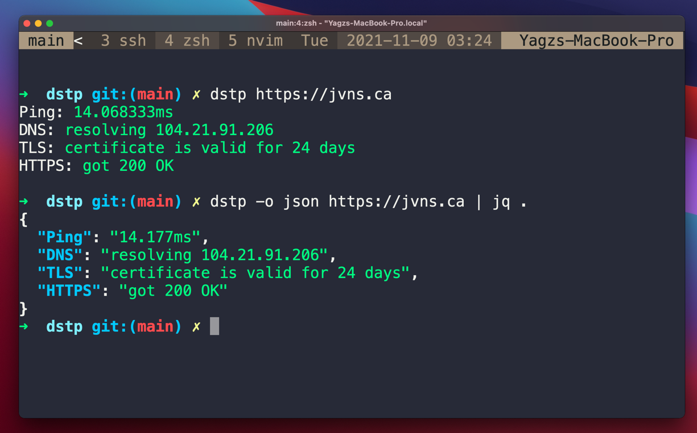

<div align="center">
<h1>dstp</h1>

[dstp](https://github.com/ycd/dstp), run common networking tests against your site.



</div>


---

## Usage

```
Usage: dstp [OPTIONS] [ARGS]
Options:
        -a, --addr   <string>  The URL or the IP address to run tests against      [REQUIRED]
        -o, --out    <string>  The type of the output, either json or plaintext    [Default: plaintext] 
        -p           <int>     Number of ping packets                              [Default: 3]
        -t           <int>     Give up on ping after this many seconds             [Default: 2s per ping packet]
        --port       <string>  Port for testing TLS and HTTPS connectivity         [Default: 443]
        --dns        <string>  Custom DNS server to use for DNS resolution         [No default]
        -h, --help             Show this message and exit.
```

## Motivation

A comment on [lobste.rs](https://lobste.rs/s/qtsklv/how_do_you_tell_if_problem_is_caused_by_dns#c_1nqkdp), in a thread
about DNS gave a great idea and thought a robust tool like that might come in handy!

## Installation

### Packages

#### Homebrew

```zsh
brew install dstp
```

#### Go Install

```zsh
go install github.com/ycd/dstp/cmd/dstp@latest
```

#### NixOS/nix

You can install dstp using one of these methods:

1. Using `nix-shell` or `nix shell` (recommended for trying it out):
```bash
nix shell nixpkgs#dstp
```

2. Adding to your NixOS configuration (system-wide installation):
```nix
# configuration.nix or home-manager configuration
{
  # ...
  environment.systemPackages = with pkgs; [
    dstp
  ];
}
```

3. Or using `nix profile` (for individual user installation):
```bash
nix profile install nixpkgs#dstp
```

#### Arch Linux

```bash
git clone https://aur.archlinux.org/dstp.git
cd dstp
makepkg -sri
```

### Downloads

Binary downloads of example are available from [the releases section on GitHub](https://github.com/ycd/dstp/releases/)
for 64-bit Windows, macOS, and Linux targets. They contain the compiled executable.

| platform     |
| ----------- | 
| [macOS ARM 64 Bit](https://github.com/ycd/dstp/releases/download/v0.4.23/dstp_0.4.23_Darwin_arm64.tar.gz)
| [macOS 64 Bit](https://github.com/ycd/dstp/releases/download/v0.4.23/dstp_0.4.23_Darwin_amd64.tar.gz)
| [Linux 32-Bit](https://github.com/ycd/dstp/releases/download/v0.4.23/dstp_0.4.23_Linux_386.tar.gz)
| [Linux ARM 64 Bit](https://github.com/ycd/dstp/releases/download/v0.4.23/dstp_0.4.23_Linux_arm64.tar.gz)
| [Linux 64 Bit](https://github.com/ycd/dstp/releases/download/v0.4.23/dstp_0.4.23_Linux_amd64.tar.gz)
| [Windows 64 Bit](https://github.com/ycd/dstp/releases/download/v0.4.23/dstp_0.4.23_Windows_amd64.zip)
| [Windows 32 Bit](https://github.com/ycd/dstp/releases/download/v0.4.23/dstp_0.4.23_Windows_386.zip)
| [Windows ARM 64 Bit](https://github.com/ycd/dstp/releases/download/v0.4.23/dstp_0.4.23_Windows_arm64.zip)

### Installation from source

0. Verify that you have Go 1.17+ installed (The source code uses _( `//go:build` )_ conditional compilation directives
   that is introduced in Go 1.17.)

   ```
   $ go version
   ```

   If `go` is not installed, follow instructions on [the Go website](https://golang.org/doc/install).

1. Clone this repository

   ```
   $ git clone https://github.com/ycd/dstp 
   $ cd dstp
   ```

2. Build and install

   #### Unix/Linux
   ```
   # May require you to use sudo
   $ go build cmd/dstp/dstp.go
   $ cp dstp /usr/local/bin/dstp
   ```

   #### Mac/BSD
   ```
   # May require you to use sudo
   $ make
   $ cp dstp /usr/local/bin/dstp
   ```

3. Verify installation

   ```
   $ dstp -h 

   Usage: dstp [OPTIONS] [ARGS]
   Options:
         -a, --addr   <string>  The URL or the IP address to run tests against      [REQUIRED]
         -o, --out    <string>  The type of the output, either json or plaintext    [Default: plaintext]
         -p           <int>     Number of ping packets                              [Default: 3]
         -t           <int>     Give up on ping after this many seconds             [Default: 2s per ping packet]
         --port       <string>  Port for testing TLS and HTTPS connectivity         [Default: 443]
         -h, --help             Show this message and exit.
   ```

---

## Appendix

The command `dstp` may collide with `docker stop`command if you are using the docker plugin with oh-my-zsh. 

To fix this, you can add the following command at the end of your `.zshrc` file:

```zsh
unalias dstp
```

## Contributing

All kinds of Pull Requests and Feature Requests are welcomed!

## Licence

dstp's source code is licenced under the [MIT License](https://choosealicense.com/licenses/mit/).
